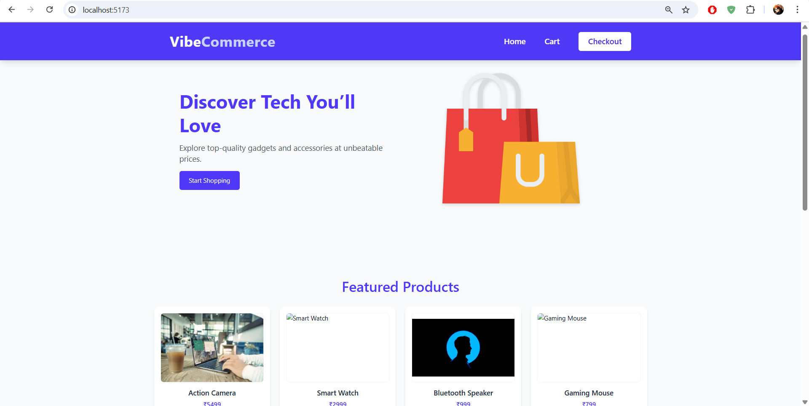
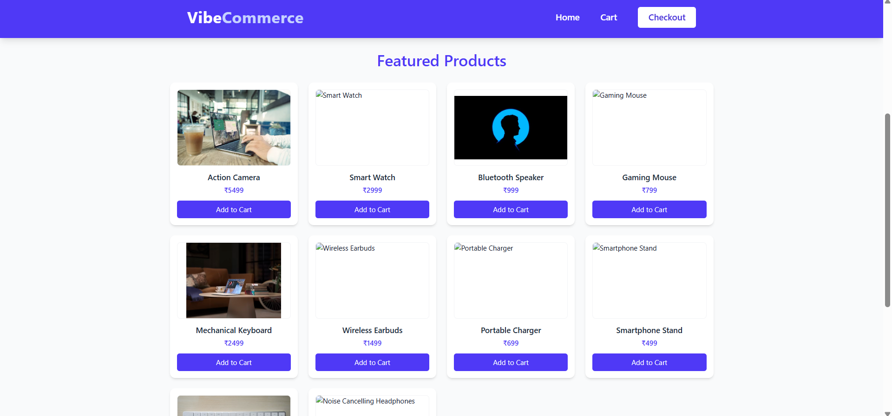
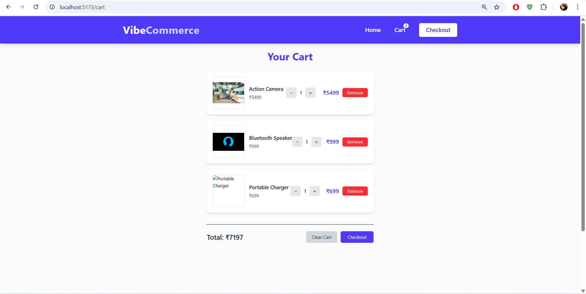
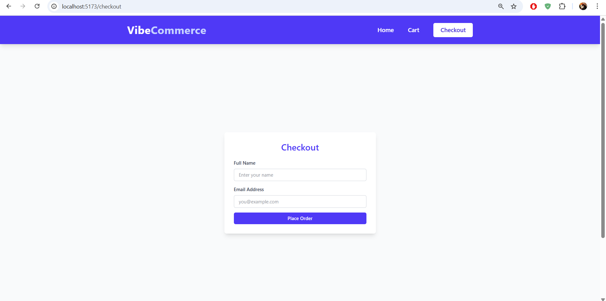
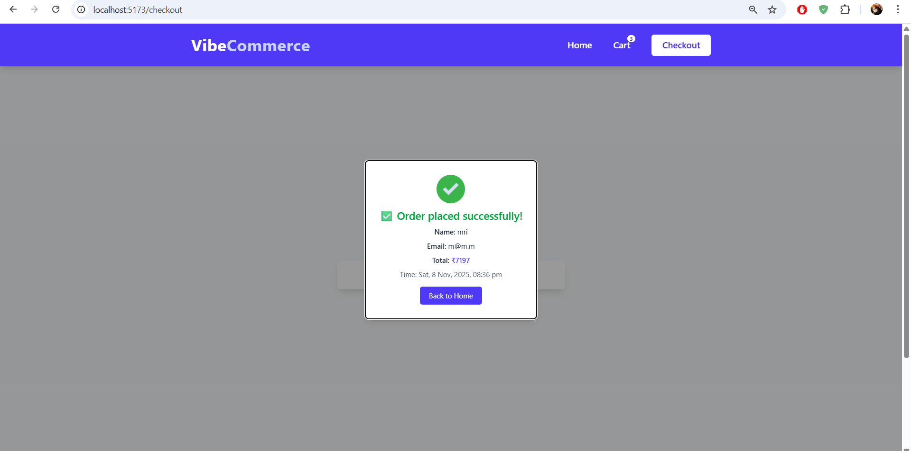

🛍️ VibeCommerce

A simple full-stack e-commerce cart app built using React, TypeScript, TailwindCSS, and Express.

This project was made as part of my Full Stack Internship Assignment for Vibe Commerce.
It’s a basic online shopping cart demo that allows users to browse mock products, add them to cart, and do a sample checkout process using REST APIs.

🚀 Tech Stack

Frontend: React (TypeScript), Vite, TailwindCSS
Backend: Node.js, Express, TypeScript
Database: Mock Data (MongoDB model added for future use)
Build Tools: Vite, ts-node, Nodemon
Styling: TailwindCSS
Extras: react-hot-toast (notifications), lucide-react (icons)

📸 Screenshots
| Home | Product List | Cart | Checkout | Receipt |
|------|---------------|------|-----------|----------|
|  |  |  |  |  |			
⚙️ Features

Display of mock product catalog with images

Add, remove, and update product quantity in cart

Real-time cart total calculation

Checkout form with name & email input

Shows receipt with timestamp and total

Cart data is saved in localStorage

Fully responsive layout (mobile + desktop)

Toast notifications for smooth user experience

```🧩 Folder Structure

mock-ecom-cart/
│
├── backend/
│   ├── src/
│   │   ├── api/          # Routes for products, cart, checkout
│   │   ├── config/       # Environment setup
│   │   ├── database/     # MongoDB connection
│   │   ├── models/       # Product schema (optional)
│   │   ├── routes/       # Route index
│   │   └── server/       # Express server setup
│   ├── package.json
│   └── tsconfig.json
│
├── frontend/
│   ├── src/
│   │   ├── components/   # Navbar, Footer, ProductImage
│   │   ├── pages/        # Home, Cart, Checkout
│   │   ├── App.tsx
│   │   └── main.tsx
│   ├── package.json
│   └── tsconfig.json
│
└── README.md'''

🛠️ Setup Instructions
1️⃣ Clone the repo
git clone https://github.com/MRI-100/VibeCommerce.git
cd VibeCommerce

2️⃣ Setup the backend
cd backend
npm install
npm run dev


Server runs on http://localhost:5000

3️⃣ Setup the frontend
cd ../frontend
npm install
npm run dev


Frontend runs on http://localhost:5173

🔗 API Endpoints
Method	Endpoint	Description
GET	/api/products	Get mock product list
GET	/api/cart	Fetch cart items + total
POST	/api/cart	Add/update item in cart
DELETE	/api/cart/:id	Remove product from cart
POST	/api/checkout	Mock checkout and get receipt

Sample Checkout Response

{
  "total": 7197,
  "timestamp": "Sat, 8 Nov 2025, 08:36 PM",
  "message": "Order placed successfully!"
}

🧠 Future Improvements

Connect MongoDB for real product persistence

Add authentication and user sessions

Integrate Fake Store API

Deploy using Render or Vercel

👨‍💻 Author

Mrityunjoy Kumar Deka
Built using React, TypeScript & Express
🔗 GitHub Profile

🪪 License

This project is licensed under the MIT License.
You can freely use, modify, or improve it for learning purposes.